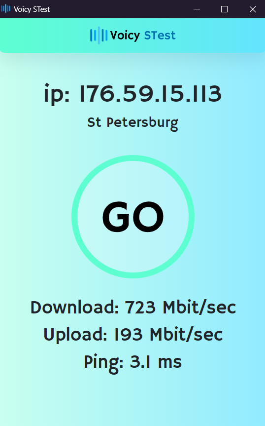

# Voicy STest

### Программа для измерения скорости интернета с веб интерфейсом на Python

---

# Установка модулей

- успользуя pip requirements.txt

<br>

```python
$ pip install -r requirements.txt
```

> Либо скачайте exe файл для Windows

---


